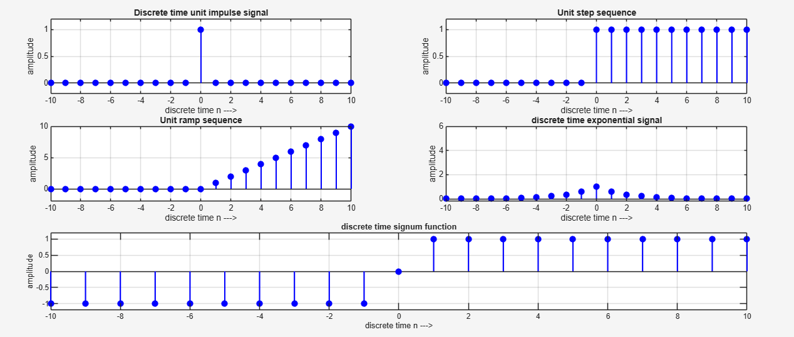
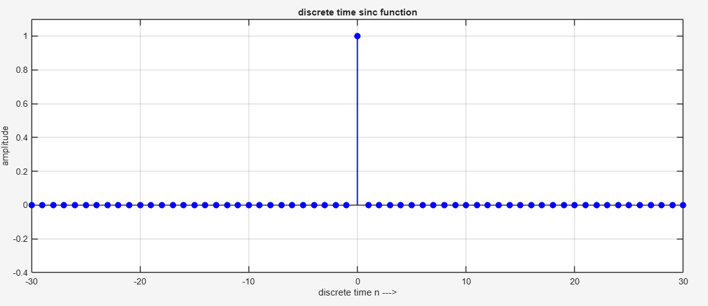

# Discrete-Time Signal Plots in MATLAB

This repository contains a MATLAB script that generates **six fundamental discrete-time signals** using `stem` plots (lollipop style), exactly as shown in standard signal processing textbooks.

---

## Signal Descriptions

| Signal | Mathematical Definition | Description |
|-------|--------------------------|-----------|
| **Unit Impulse** | <code>δ[n] = 1 if n=0, 0 otherwise</code> | A single "1" at `n=0`, zero elsewhere. Used to test system response. |
| **Unit Step** | <code>u[n] = 1 for n≥0, 0 otherwise</code> | Turns "on" at `n=0` and stays 1 forever. |
| **Unit Ramp** | <code>r[n] = n·u[n]</code> | Linearly increasing sequence starting at `n=0`. |
| **Exponential Decay** | <code>x[n] = exp(-|n|/2)</code> | Symmetric two-sided exponential decay (faster on one side if modified). |
| **Signum Function** | <code>sgn(n) = -1 (n<0), 0 (n=0), +1 (n>0)</code> | Discrete equivalent of the sign function. |
| **Discrete Sinc** | <code>sinc(n) = sin(πn)/(πn), sinc(0)=1</code> | Sampled version of continuous sinc; oscillates and decays. |

---

## Sample Plots

### Figure 1 – All Discrete Signals (3×2 Layout)



- **Top row**: Unit impulse, Unit step  
- **Middle row**: Unit ramp, Exponential decay  
- **Bottom row (full width)**: Signum function

---

### Figure 2 – Discrete-Time Sinc Function



> Shows oscillatory behavior with zeros at integer multiples of π (except n=0).

---

## Requirements

- **MATLAB** R2016b or later
- No toolboxes required

---

## How to Run

1. **Clone the repository**

   ```bash
   git clone https://github.com/your-username/discrete-time-signals.git
   cd discrete-time-signals
